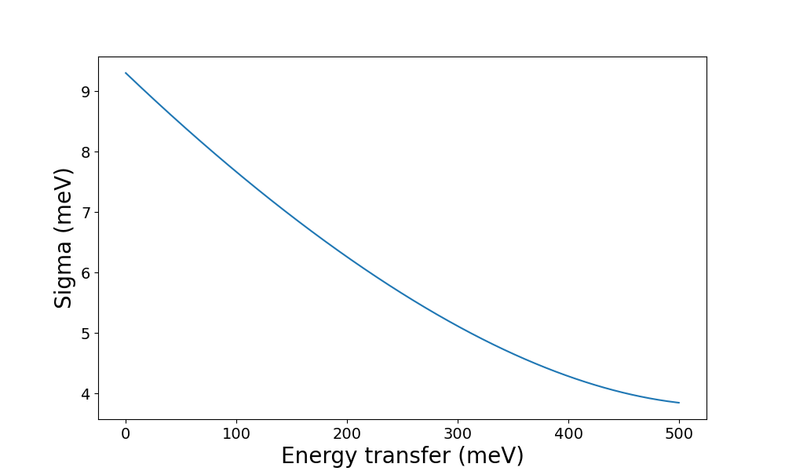
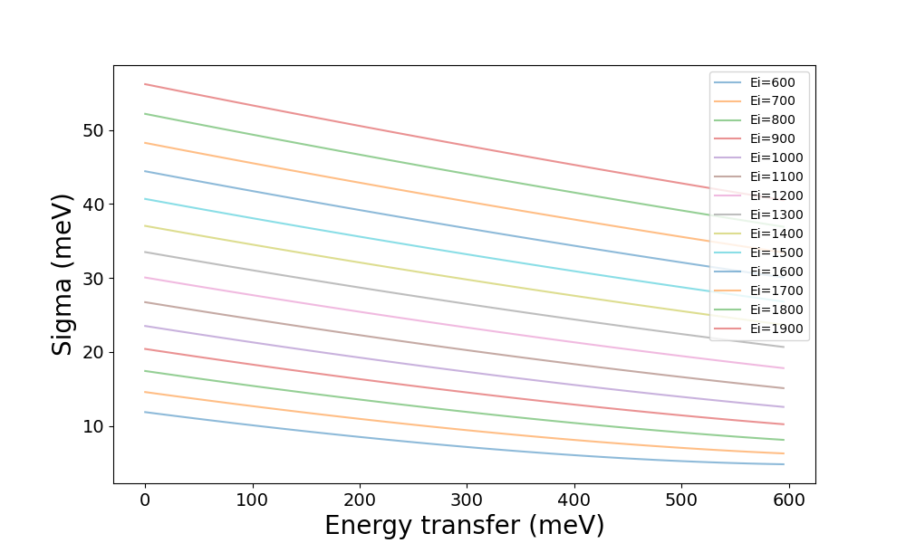
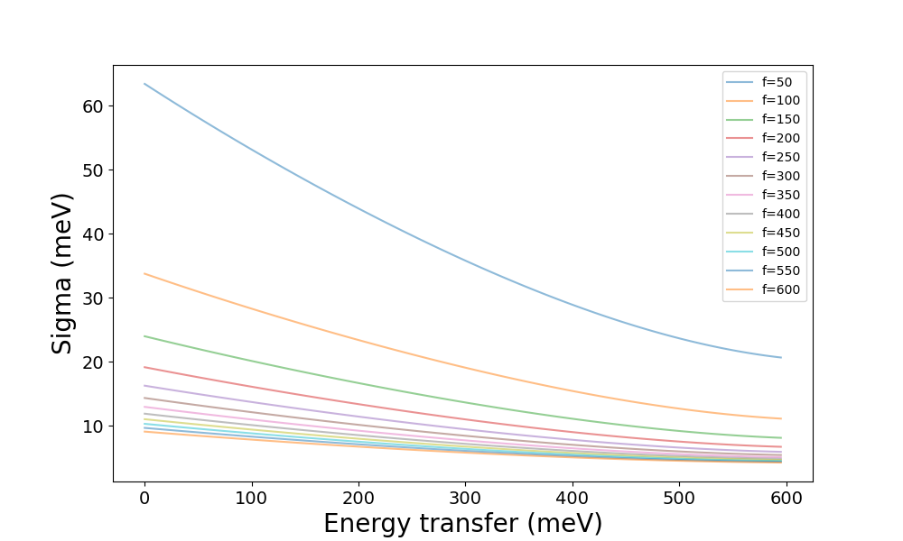

How To Use ResINS To Find Optimal Experimental Settings
=======================================================

The data stored within ResINS can also be leveraged to plan INS experiments. One
aspect of this is determining the optimal :term:`settings<setting>` to use for
an experiment. This guide aims to show the steps required to write a script that
uses ResINS for this purpose, but please note:

.. important::

    while this guide guarantees that the code will be correct, it **cannot**
    provide specific scientific guidance for any given scientific question. Some
    general advice is given, but consult a domain-area expert for any science
    concerns. Different experiments *will* require different considerations.

Using resolution plots
----------------------

The optimal experimental :term:`settings<setting>` can be estimated using purely
ResINS and a plotting library, though some knowledge of the system under
investigation is still required. To do this, the :term:`instrument`, the
:term:`model`, and the :term:`option` for each :term:`configuration` have to
have been chosen. The first step is to create the instrument:

>>> from resolution_functions import Instrument
>>> maps = Instrument.from_default('MAPS')
>>> print(maps)
Instrument(name=MAPS, version=MAPS)

and then find the :term:`settings<setting>` and their defaults:

>>> data = maps.get_model_data('PyChop_fit')
>>> data.defaults
{'e_init': 500, 'chopper_frequency': 400}

which can be used as a starting point to generate some resolution data:

>>> import numpy as np
>>> model = maps.get_resolution_function('PyChop_fit', chopper_package='B')
>>> energies = np.arange(0, data.defaults['e_init'], 0.5)
>>> resolution = model(energies)

Plotting with matplotlib:

.. code-block:: Python

    import matplotlib.pyplot as plt

    fig, ax = plt.subplots(figsize=(10, 6))

    ax.plot(energies, resolution)

    ax.set_xlabel('Energy transfer (meV)', fontsize=20)
    ax.set_ylabel('Sigma (meV)', fontsize=20)
    ax.tick_params(labelsize=14)

    plt.show()

From here it should be possible to get an idea of the
:term:`instrument` properties and check whether the other choices (e.g.
:term:`configuration`) seem reasonable. If so, the next
step is to plot the resolution at different combinations of the
:term:`settings<setting>`:

>>> data.restrictions
{'e_init': [0, 2000], 'chopper_frequency': [50, 601, 50]}

The ``restrictions`` provide information about the allowed values for each
:term:`setting`. In the case of the MAPS instrument, there are two
settings:

* ``e_init`` for which all values between ``0`` and ``2000`` meV are allowed
* ``chopper_frequency`` for which values ``50``, ``100``, ``150``, ... are allowed up to ``600`` Hz.

Scientific constraints may also apply. For example, the direct-geometry instrument
MAPS can only observe values of energy transfer up to the incident energy (``e_init``). 
If we intend to investigate spectral features between 100 and 600 meV, the useful ``e_init`` settings are limited to values above 600 meV:

>>> max_feature = 600
>>> test_e_init = np.arange(max_feature, max(data.restrictions['e_init']), 100)
>>> test_choppers = np.arange(*data.restrictions['chopper_frequency'])

All the data can then be generated using by loopiing over these variables:

>>> energy_transfer = np.arange(0, max_feature, 5)
>>> results = np.zeros((len(test_choppers), len(test_e_init), len(energy_transfer)))
>>> for i, chopper_frequency in enumerate(test_choppers):
...     for j, e_init in enumerate(test_e_init):
...         model = maps.get_resolution_function('PyChop_fit', chopper_package='B', e_init=e_init, chopper_frequency=chopper_frequency)
...         results[i, j, :] = model(energy_transfer)

This can then be plotted in various ways. For example, we can check the effect
of ``e_init`` by plotting the resolution for its different values at a constant
``chopper_frequency``, e.g. the default of 400 Hz:

from which we might conclude that a low value for ``e_init`` is desirable, so we
might follow up by comparing the different values of ``chopper_frequency`` at
the lowest value of ``e_init``, 600:

which might suggest that ``chopper_frequency`` of 300 Hz and above gives
tolerable resolution. Then, if the features are expected to be further apart
than the resolution, they should be distinguishable in an INS experiment. If
that is not the case, it might mean that this combination of :term:`instrument`,
:term:`configurations<configuration>`, and :term:`settings<setting>`
is unsuitable.

Using simulated spectra
-------------------------

The other way to estimate the optimal experimental :term:`settings<setting>` is
to simulate spectra from *ab initio* lattice dynamics or molecular dynamics, e.g. using
`AbINS <https://github.com/mantidproject/mantid/tree/main/scripts/abins>`_ or
`dynasor <https://dynasor.materialsmodeling.org/index.html>`_, and then convolve
the ResINS resolution using a library like
`euphonic <https://euphonic.readthedocs.io/en/stable/>`_.
Again, we begin by creating the Instrument:

>>> from resolution_functions import Instrument
>>> maps = Instrument.from_default('MAPS')
>>> print(maps)
Instrument(name=MAPS, version=MAPS)

and getting :term:`settings<setting>` and their defaults:

>>> data = maps.get_model_data('PyChop_fit')
>>> data.defaults
{'e_init': 500, 'chopper_frequency': 400}

The defaults can be used as the starting point:

>>> model = maps.get_resolution_function('PyChop_fit', chopper_package='B')

However, before proceeding, the computational data has to be loaded (here
represented using ``np.load`` but this will depend on the origin of the data):

>>> import numpy as np
>>> energies = np.load('path/energies.npy')
>>> s_qw = np.load('path/sqw.npy')
>>> bin_edges = np.load('path/bin_edges.npy')

after which euphonic can be used to broaden the spectrum:

>>> from euphonic import ureg
>>> from euphonic.spectra import Spectrum2D
>>> spectrum = Spectrum2D(x_data=bin_edges * ureg('1/angstrom'),
...                       y_data=energies * ureg('meV'),
...                       z_data=s_qw * ureg('dimensionless'))
>>> spectrum.y_data_unit = 'meV'
>>> broadened = spectrum.broaden(x_width=1e-3 * ureg('1/angstrom'),
...                              y_width=lambda energy: model(energy.to('meV').magnitude) * ureg('meV'),
...                              width_convention='std',
...                              method='convolve')

as well as plot it:

>>> from euphonic.plot import plot_2d
>>> fig = plot_2d(broadened)
>>> fig.savefig('test.png')
